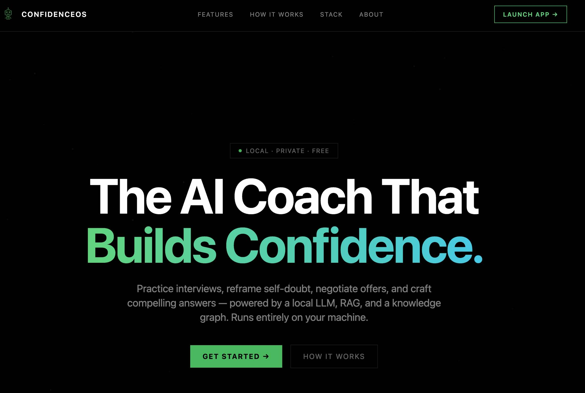
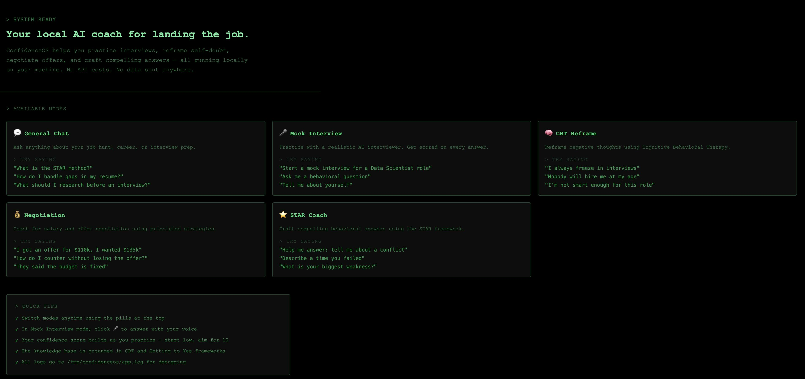
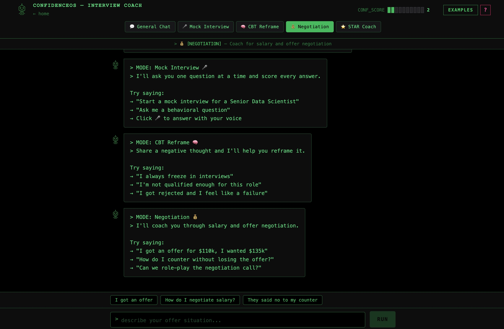

# ConfidenceOS — AI-Powered Interview Confidence Coach


> *Built by a job seeker, for job seekers — powered by local LLMs, RAG, and a knowledge graph.*

> ⭐ **This is a portfolio project.** Feel free to fork it, run it locally, and adapt it for your own use. Direct PRs are not actively reviewed but issues and feedback are always welcome!
---

## Screenshots

### Landing Page


### Example Prompts


### Coaching Modes in Action
*General Chat · Mock Interview · Negotiation — each mode has its own system prompt and coaching style.*


---

## Why This Project

Most interview prep tools are static. ConfidenceOS is conversational, contextual, and adaptive:
- It **retrieves relevant knowledge** from indexed books using hybrid semantic + keyword search (Pinecone + BM25)
- It **reranks results** using a cross-encoder model for higher relevance quality
- It **traverses relationships** between concepts, frameworks, and techniques (Neo4j AuraDB)
- It **detects emotional tone** in your messages and adjusts its coaching style accordingly
- It **remembers your session** — your name, target role, and progress across the conversation
- It **switches between coaching modes** — from mock interviews to CBT reframing to salary negotiation
- It **scores your answers** live — STAR structure, language confidence, relevance, and overall

---

## Tech Stack

| Layer | Technology |
|---|---|
| LLM (local) | Ollama — llama3.2 |
| Embeddings | nomic-embed-text (768-dim, local) |
| Triple extraction | qwen2.5:7b-instruct (local) |
| Agent orchestration | LangGraph |
| Vector search | Pinecone |
| Knowledge graph | Neo4j AuraDB |
| Retrieval strategy | Hybrid — dense + BM25 + cross-encoder reranking |
| Reranker | cross-encoder/ms-marco-MiniLM-L-6-v2 |
| Backend API | FastAPI |
| Frontend | React + Vite + Tailwind CSS |
| Logging | Rotating file handler — `/tmp/confidenceos/` |

---

## Agent Modes

| Mode | Icon | Description |
|---|---|---|
| General Chat | 💬 | Open conversation about career and job hunt |
| Mock Interview | 🎤 | Realistic interview Q&A with live scoring |
| CBT Reframe | 🧠 | Reframe negative thoughts using CBT techniques |
| Negotiation | 💰 | Salary and offer negotiation coach |
| STAR Coach | ⭐ | Craft strong behavioral interview answers |

Each mode has its own system prompt in `prompts.py` — edit them freely without touching any code.

---

## Knowledge Base

The following documents are pre-indexed and power the RAG and knowledge graph retrieval. All chunks are stored in **Pinecone** (vector search) and key concepts/relationships are stored in **Neo4j AuraDB** (graph search).

### Indexed Documents

| # | Document | Domain |
|---|---|---|
| 1 | Cognitive Behavior Therapy — Basics and Beyond *(Judith S. Beck)* | CBT, mental frameworks |
| 2 | A Guide to Rational Living *(Albert Ellis & Robert Harper)* | Rational Emotive Therapy |
| 3 | Getting to Yes *(Fisher, Ury & Patton)* | Principled negotiation |
| 4 | Difficult Conversations — How to Discuss What Matters Most | Communication, conflict |
| 5 | Motivational Interviewing — Helping People Change and Grow | Behaviour change |
| 6 | Nonviolent Communication — A Language of Life *(Marshall Rosenberg)* | Empathic communication |

### Embedding & Indexing Config

| Setting | Value |
|---|---|
| Embedding model | `nomic-embed-text` (via Ollama, local) |
| Embedding dimension | 768 |
| Pinecone metric | Cosine |
| Pinecone namespace | `documents` |
| Triple extraction model | `qwen2.5:7b-instruct` (via Ollama, local) |
| Retrieval strategy | Hybrid — dense (Pinecone) + sparse (BM25) + cross-encoder reranking |
| Reranker model | `cross-encoder/ms-marco-MiniLM-L-6-v2` (HuggingFace, local) |

### Neo4j AuraDB Graph Schema

```
Node labels    : Chunk, Framework, Concept, Technique, Scenario, Emotion
Relationships  : (Framework)-[:CONTAINS]->(Chunk)
                 (Chunk)-[:USES]->(Technique)
                 (Chunk)-[:APPLIES_TO]->(Scenario)
                 (Chunk)-[:TRIGGERS]->(Emotion)
                 (Chunk)-[:MENTIONS]->(Concept)
```

### Adding Your Own Documents

To extend the knowledge base with your own books or articles:

1. Chunk your PDF into overlapping text segments
2. Embed each chunk using `nomic-embed-text` via Ollama
3. Upsert into Pinecone with metadata: `source`, `chunk_id`, `title`, `themes`, `best_for`
4. Store chunk text as a JSON file in `chunk_texts/` named `{source}_texts.json`
5. Use `qwen2.5:7b-instruct` to extract triples and add nodes/relationships to Neo4j AuraDB

> **Models required for ingestion:**
> ```bash
> ollama pull nomic-embed-text       # for Pinecone embeddings
> ollama pull qwen2.5:7b-instruct    # for Neo4j triple extraction
> ```
> Your Pinecone index dimension must match the embedding model (768 for `nomic-embed-text`). If you switch models, recreate the index.

---

## Project Structure

```
local-rag-agent/
├── .env                        ← your secret keys (never commit this)
├── .env.example                ← template for environment variables
├── chunk_texts/                ← local JSON files with chunk text
├── backend/
│   ├── config.py               ← reads all env vars
│   ├── prompts.py              ← ALL system prompts (edit freely)
│   ├── emotion.py              ← emotion detection logic
│   ├── memory.py               ← session memory + LangGraph checkpointer
│   ├── retrieval.py            ← hybrid search + reranking pipeline
│   ├── tools.py                ← all LangGraph tools
│   ├── agent.py                ← LangGraph graph definition
│   ├── main.py                 ← FastAPI app
│   ├── logger.py               ← rotating file logger
│   └── requirements.txt
└── frontend/
    ├── .env                    ← VITE_API_URL
    └── src/
        ├── App.jsx             ← React chat UI
        ├── Landing.jsx         ← Landing page
        ├── BotIcon.jsx         ← Geometric bot SVG icon
        ├── Onboarding.jsx      ← Getting started screen
        └── HelpGuide.jsx       ← Slide-in help panel
```

---

## How It Works

```
User message
    ↓
React UI sends message + session_id + mode
    ↓
FastAPI /chat endpoint
    ↓
emotion.py detects tone (distressed / positive / neutral)
    ↓
prompts.py loads mode-specific system prompt
memory.py injects session context (name, role, topics, confidence)
    ↓
LangGraph agent (Ollama LLM — llama3.2)
    ↓ (if tool needed)
retrieval.py → hybrid search (Pinecone dense + BM25 sparse + reranking)
query_auradb → Cypher query against Neo4j knowledge graph
    ↓
LangGraph MemorySaver persists conversation across turns
    ↓
Reply returned to UI with live confidence scores
```

---

## Prerequisites

1. **Ollama** — https://ollama.com
2. **Python 3.10+**
3. **Node.js 18+**
4. **Pinecone** account — https://pinecone.io
5. **Neo4j AuraDB** free instance — https://neo4j.com/cloud/aura

---

## Setup

### 1. Pull Ollama models
```bash
ollama pull llama3.2            # chat model
ollama pull nomic-embed-text    # embedding model
ollama pull qwen2.5:7b-instruct # triple extraction (for ingestion)
ollama serve
```

### 2. Configure `.env`
```bash
OLLAMA_BASE_URL=http://localhost:11434
OLLAMA_MODEL=llama3.2
PINECONE_API_KEY=your-key
PINECONE_INDEX_NAME=your-index
PINECONE_NAMESPACE=documents
NEO4J_URI=neo4j+s://xxxxxxxx.databases.neo4j.io
NEO4J_USERNAME=neo4j
NEO4J_PASSWORD=your-password
APP_HOST=0.0.0.0
APP_PORT=8000
CORS_ORIGINS=http://localhost:5173
```

### 3. Backend
```bash
cd backend
python -m venv venv && source venv/bin/activate
pip install -r requirements.txt
uvicorn main:app --reload --port 8000
```

### 4. Frontend
```bash
cd frontend
npm install
npm run dev
```

---

## Testing the App — Try These in Order

**Test 1 — General chat:**
```
Tell me about yourself
```

**Test 2 — Mock interview (switch to 🎤 mode):**
```
Start a mock interview for a Senior Product Manager role
```

**Test 3 — CBT reframe (switch to 🧠 mode):**
```
I'm terrible at interviews, I always freeze up
```

**Test 4 — Negotiation (switch to 💰 mode):**
```
I got an offer for $120k but I was expecting $140k
```

**Test 5 — STAR coach (switch to ⭐ mode):**
```
Help me answer: tell me about a time you handled a conflict
```

**Test 6 — Pinecone hybrid RAG:**
```
What does the knowledge base say about handling anxiety?
```

**Test 7 — AuraDB graph:**
```
What techniques are used in CBT chunks?
```

> ✅ Tests 1–5 work immediately.
> ⚠️ Tests 6–7 require data in Pinecone and AuraDB.

---

## Customising Prompts

All prompts live in `backend/prompts.py`. You can:
- Edit ConfidenceOS's persona in the `PERSONA` string
- Change how each mode behaves in the `PROMPTS` dict
- Add a new mode by adding a key to `PROMPTS` and an entry to `get_available_modes()`

No code changes needed — just edit the text and restart the backend.

---

## Contributing & Forking

This project is primarily a personal portfolio piece — see [CONTRIBUTING.md](./CONTRIBUTING.md) for full details.

**Short version:**
- Fork it freely and adapt it for your own use ✅
- Open issues for bugs or suggestions ✅
- Direct PRs are not actively reviewed ⚠️

If you build something cool on top of it, share it!

---

## Extending the App

- **Add a new mode** → add to `PROMPTS` and `get_available_modes()` in `prompts.py`
- **Add a new tool** → define `@tool` in `tools.py`, add to `ALL_TOOLS`
- **Add streaming** → replace `graph.invoke()` with `graph.stream()` + FastAPI `StreamingResponse`
- **Add more books** → index chunks into Pinecone + add nodes to AuraDB
- **Persist memory** → swap `MemorySaver` in `memory.py` for Redis or SQLite checkpointer

---

## 🚧 Work in Progress

This project is actively being developed. The current version is a working foundation — here's what's coming next:

- **Cloud deployment** — migrate backend and vector infrastructure to AWS or GCP for production-grade reliability and scalability
- **Richer knowledge base** — index additional books, articles, and interview guides into Pinecone for deeper, more contextual coaching
- **Evaluation framework** — add automated quality scoring for agent responses, RAG retrieval accuracy, and answer relevance
- **UI overhaul** — improve the chat experience with better formatting, session history sidebar, progress tracking, and mobile responsiveness
- **MCP server integration** — connect to external tools via Model Context Protocol (calendar, LinkedIn, job boards) to make ConfidenceOS aware of your real job hunt pipeline
- **Optimised retrieval layer** — improve RAG performance with hybrid search (dense + sparse), re-ranking, query expansion, and smarter chunk selection strategies

Contributions, feedback, and ideas are welcome!