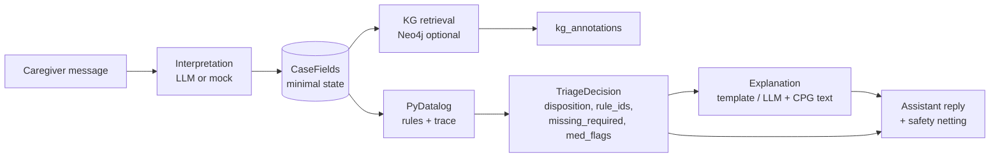
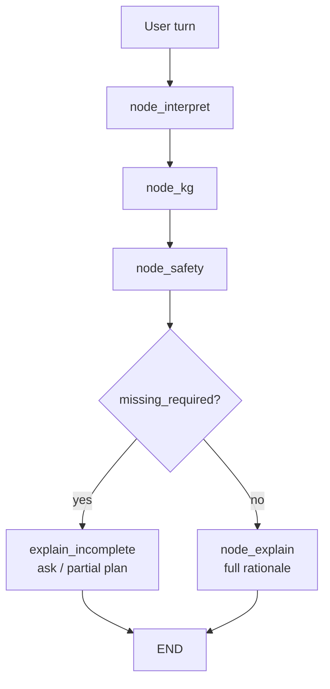
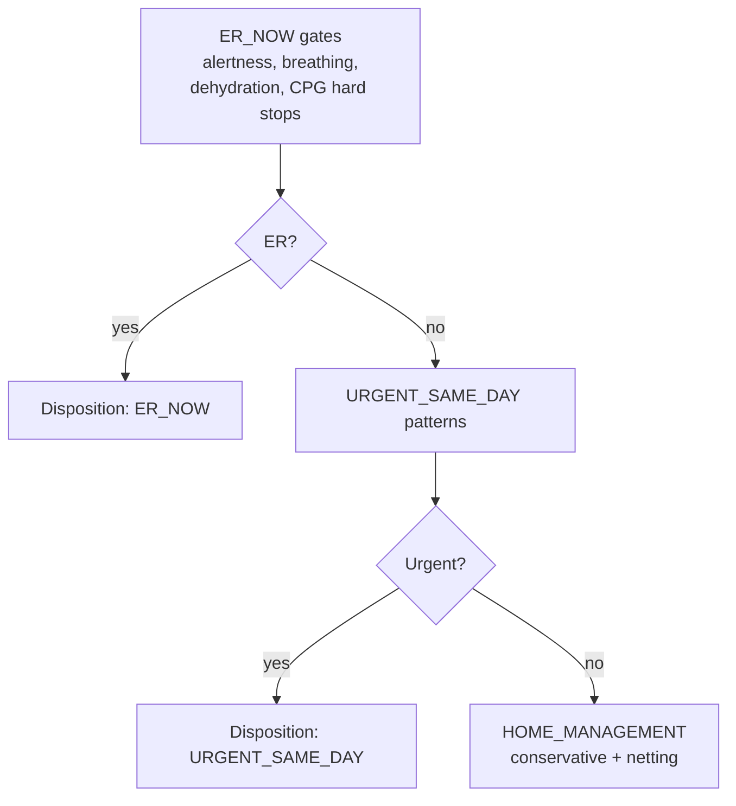

# CareTrace — slide copy, notes, and diagrams

Use this with **`Docs/CareTrace_FinalPresentation.pptx`**. The deck is a **clinical case-report** Slidesgo template; **repurpose headings** (Abstract, Case presentation, Discussion, etc.) as labeled below. You can **delete** slides 3 (template promo), 21–41 (icons / instructions / blank duplicates) once you no longer need them—keep slide 20 (“Thanks”) if attribution is required.

**Title slide:** the typo `CareTace` → **CareTrace** was corrected in `CareTrace_FinalPresentation.pptx`. A copy of the file **before** that edit is `CareTrace_FinalPresentation.pptx.bak` (if present in your tree).

---

## Table of contents (slide 4 — replace the six items)

Suggested numbering for a ~12–15 minute talk:

1. **Problem & scope** — after-hours pediatric triage, narrow clinical bundle  
2. **Design principles** — SNOMED IDs, small KG, safety first  
3. **System architecture** — modular pipeline + LangGraph  
4. **Knowledge & rules** — seed KG, manual relations, PyDatalog  
5. **Evaluation & failure mode** — scenarios, baseline LLM, honest limitation  
6. **Deliverables & takeaways** — report, code, what we learned  

---

## Slide 1 — Title

- **Title:** CareTrace  
- **Subtitle:** A neurosymbolic assistant for **scoped** after-hours pediatric triage (fever + GI + dehydration cues), with **auditable rules** and **explicit safety netting**

**Speaker notes:**  
Frame this as a *course prototype*, not a product. Emphasize **trustworthiness**: symbolic layer holds disposition and rule IDs; language layer explains. UI is intentionally minimal (CLI / chat)—grading cares about **integration and reasoning**, not polish.

---

## Slide 2 — Introduction (replace “case report abstract” boilerplate)

**Title:** Introduction  

**Bullets:**

- **Problem:** Caregivers need structured guidance after hours; pure LLM outputs are hard to **validate** and may **drift** under stress.  
- **Approach:** **Neurosymbolic** — natural language **in**, canonical **case state** + **logic** + optional **KG retrieval**, then **constrained** natural language **out**.  
- **Scope (intentionally small):** Febrile illness, vomiting/fluids, dehydration risk, medication flags — aligned with a real **fever CPG** (Seattle Children’s) for teaching grounding.  
- **Non-goals:** Full EMR, all of SNOMED, or a polished app — **chat is enough**.

**Speaker notes:**  
Mention **60-point** emphasis: **safety / constraints**, **reasoning quality**, **system integration**. You are *not* claiming clinical deployment.

---

## Slide 5 — Abstract (short “elevator”)

**Title:** Abstract  

**Bullets (3–4 max):**

- **CareTrace** turns caregiver messages into **`CaseFields`**, runs **PyDatalog triage rules** with a **rule trace**, optionally **annotates** mentions against a **small Neo4j graph** (SNOMED-style IDs).  
- **Disposition** is **symbolic** (`ER_NOW`, `URGENT_SAME_DAY`, `HOME_MANAGEMENT`, `OUT_OF_SCOPE`); the assistant reply **must-ask** gates missing critical fields before finalizing.  
- **Collaboration / stack:** Python package, **LangGraph** orchestration, **GitHub** + notebook-friendly workflow (e.g. Colab for KG experiments).  

**Speaker notes:**  
One sentence version: “We separate **what the system decided and why (rules)** from **how we say it (templates / LLM)**.”

---

## Slide 6 — Importance / motivation

**Title:** Why safety-first neurosymbolic design?  

**Bullets:**

- **Graded on:** constraint handling, reasoning, **tight coupling** between interpretation → state → rules → explanation — not on retrieval glamour.  
- **Symbolic core:** Escalation paths are **explicit** (e.g. altered mental status, breathing distress, severe dehydration pattern, CPG “call doctor now” items).  
- **Traceability:** Decisions carry **`rule_ids`** (e.g. `R_HOME_CONSERVATIVE`, `R_CPG_SEIZURE`) for audit-style explanation.  
- **KG role:** **Support** reasoning and vocabulary — **not** replace gates; **manual** relationships over importing all of SNOMED.

**Speaker notes:**  
Contrast with “RAG-only”: here, **wrong retrieval** cannot silently override a hard **ER** rule if the structured case satisfies it.

---

## Slide 7 — “Case presentation” → minimal patient state

**Title:** Minimal state, not a full chart  

**Bullets:**

- **`CaseFields`:** age, temperature, alertness, breathing, vomiting, fluid intake, urine in ~8h, meds, seizure, fever duration — **only what rules need**.  
- **Interpretation** (LLM or mock/heuristic) **fills or updates** this struct from free text.  
- **Required-for-safe-plan** gating: system may **ask** for missing **temp / alertness / breathing / fluids / urine** before treating the plan as complete.  
- **Local context** (e.g. “stomach bug at school”) stored as a **soft prior** — **does not override** hard safety rules.

**Speaker notes:**  
This directly answers design guidance: **avoid over-modeling** the patient; keep state **small** and **inspectable**.

---

## Slide 8 — Diagnosis-style slide → KG & SNOMED strategy

**Title:** Knowledge graph — seed, don’t boil the ocean  

**Bullets:**

- **SNOMED CT** (or compatible) **concept IDs** as **stable keys** for a **small** set: symptoms, findings, **CPG-aligned** fever concepts — **not** the whole ontology.  
- **Scalable pattern:** **Seed concepts** → **expand gradually** (notebook-driven imports, team-friendly).  
- **Manual / curated edges** for the demo KG (e.g. IS-A, RELATED_TO) — **avoid** depending on the full SNOMED graph complexity for the class project.  
- **Neo4j** optional at runtime (`CARETRACE_SKIP_NEO4J=1` for CI / laptops); retrieval **augments** explanations, **not** the only source of truth.

**Speaker notes:**  
If asked “why not full SNOMED?” — **time, noise, and grading focus**: we need **demonstrable reasoning**, not maximum triple count.

---

## Slide 9 — Conclusion-style slide → Rules & PyDatalog

**Title:** Rule engine — PyDatalog + ranking in Python  

**Bullets:**

- **Facts** `cf(session, field, value)` derived from `CaseFields` (including derived flags like CPG-linked predicates).  
- **Layers:** `er_now` → `urgent_same_day` → `home_candidate`, with **medication flags** (e.g. antibiotic on file → review interactions).  
- **Output:** `TriageDecision`: `disposition`, `rule_ids`, `missing_required`, `med_flags`, `out_of_scope_reason`.  
- **Principle:** **Prioritize safety checks and validation** over fancy retrieval.

**Speaker notes:**  
Mention **one example rule chain** verbally: e.g. infant &lt;3 months fever → ER pathway from CPG mapping.

---

## Slide 10 — Charts slide → replace fake “20,000 patients”

**Title:** Evaluation approach (qualitative + structured)  

**Suggested numbers (only if true for your runs):**

| Label | Replace with |
|--------|----------------|
| Patients on the study | **Scenario suite** (CSV rows) or **N turns replayed** |
| Placebo / secondary effects | **Expected disposition match** vs **actual** |
| Other columns | **Baseline LLM** vs **CareTrace** side-by-side on same transcript |

**Bullets if you drop the chart:**

- **`caretrace/evaluation`**: replay **`turns_json`**, check `expected_disposition`.  
- **`Baseline_Ollama_Chat_Eval.ipynb`**: same transcript → **unconstrained** LLM vs **rule-gated** CareTrace.  

**Speaker notes:**  
Honest: small **N** is fine for the course; **method** matters. Point to **reproducible** commands in README.

---

## Slide 11 — “95%” slide → rubric alignment

**Title:** What graders (and clinicians) should see  

**Bullets:**

- **Safety & constraints:** Hard gates, must-ask fields, out-of-scope handling.  
- **Reasoning quality:** Rule trace in the UI / notebook output (`rule_ids`).  
- **Integration:** LangGraph **interpret → KG → safety → explain** is one **graph**, not loose scripts.  
- **Trust:** Disposition from **logic**; text **explains** and **nets** risks (CPG URL, red flags).

**Speaker notes:**  
If you use a percentage, make it **your** scenario pass rate after a run, not a made-up clinical statistic.

---

## Slide 12 — “Picture is worth…” → **Architecture diagram**

**Title:** End-to-end architecture  

**Action:** Paste an exported PNG from the **Mermaid block below** (or redraw in PowerPoint using the same boxes).

**Speaker notes:**  
Walk left-to-right once slowly; stress **two outputs**: structured `decision` + natural language `assistant_reply`.

---

## Slide 13 — Graph slide → **pipeline / flow**

**Title:** Control flow (LangGraph)  

**Action:** Use the **flowchart Mermaid** below; or a simple **swimlane**: User → Interpret → State → Rules → Explain.

**Speaker notes:**  
Mention **branch**: if `missing_required` → incomplete explanation path / prompts for missing fields (align with your `route_after_safety` behavior).

---

## Slide 14 — Table slide → component matrix

**Title:** Code organization  

| Component | Role |
|-----------|------|
| `interpretation` | Text → `CaseFields` |
| `graph/` | Neo4j client, SNOMED/CPG mention → annotations |
| `logic/triage_rules` | PyDatalog + decision struct |
| `agents/explanation` | Template / LLM rationale + CPG language |
| `orchestration/graph` | LangGraph wiring |
| `evaluation` | Scenario CSV + harness |

**Speaker notes:**  
Tie to “**separate KG, logic, etc.**” from the assignment guidance.

---

## Slide 15 — Milestones → **your pipeline as timeline**

**Title:** Session flow — modular stages  

Replace milestone text with:

1. **Intake** — user message  
2. **Interpretation** — update `CaseFields`  
3. **State update** — merge with prior turn  
4. **KG annotate** (optional) — mentions → graph hits  
5. **Rule check** — disposition + missing required  
6. **Decision + response** — traced explanation to caregiver  

**Speaker notes:**  
This is the **exact** simplification the rubric asked for—**not** ten micro-agents.

---

## Slide 16 — Patient demographics slide → **worked example state**

**Title:** Example: structured case after two turns  

**Table (example):**

| Field | Value |
|--------|--------|
| Age | 6 years |
| Temp | 101.8 °F |
| Alertness | Normal / tired but responsive |
| Breathing | Normal |
| Fluids | Some |
| Urine | Yes |
| Meds | Amoxicillin (ear infection) |

**Footer:** Interpreter extracts this; rules consume **enumerated** values, not raw prose.

**Speaker notes:**  
Connect to **`med_flags`** if antibiotic present — stewardship / interaction **awareness** without dosing.

---

## Slide 17 — Discussion → **challenges**

**Title:** Design challenges  

**Bullets:**

- **Balancing** LLM flexibility vs **stable** structured fields (hallucinated vitals — mitigated by “don’t invent” prompts + must-ask).  
- **KG heterogeneity** — different Neo4j schemas (Snowstorm vs mini-KG); **fallback Cypher** in code.  
- **Scope creep** — resisting “import all of SNOMED” in favor of **seed + manual relations**.  
- **LAG / OpenAI paths** — optional narration layer; **mock mode** uses templates (explain **gating** if you demo env flags).

**Speaker notes:**  
Shows **reflection**; graders like “what broke and what we did.”

---

## Slide 18 — Outcomes & recommendations

**Title:** Deliverables & demo structure  

**Columns / bullets:**

- **Written report** — design, KG, rules, evaluation, limitations.  
- **Slides + live demo** — CLI or notebook, **one success** + **one failure** (no penalty).  
- **Failure example idea:** Baseline LLM suggests **home-only** wording when **structured state** would fire **urgent/ER** if the user later admits red-flag symptoms — or **CareTrace** correctly escalates when fields are complete; OR **out-of-scope** condition.  
- **Future:** richer CPG coverage, clinician review, larger scenario set.

**Speaker notes:**  
**Failure** = show **honest limits** — e.g. interpretation wrong if user is contradictory; **KG skipped** offline; **rule gap** you document.

---

## Slide 19 — Photo showcase → **screenshots**

**Title:** Demo  

Replace images with:

- Terminal or notebook: **decision JSON** + **sectioned explanation** (use `display_caretrace_turn` from `caretrace.pretty_output`).  
- Optional: Neo4j Bloom / browser — **one** subgraph around **Fever** concept.  

**Speaker notes:**  
Live run `replay_turns` or `python -m caretrace.main` with `CARETRACE_MOCK_LLM=1`.

---

## Slide 20 — Q&A

Keep contact placeholders or replace with your email.  

**Speaker notes:**  
Be ready to answer: **Why PyDatalog?** **Why LangGraph?** **What if Neo4j is down?** (Rules still run.)

---

# Mermaid — paste at https://mermaid.live → Export PNG → insert slides 12–13

## Architecture (slide 12)

## LangGraph-style sequencing (slide 13)

## Safety-first ranking (optional extra slide)

---

# One-slide “failure mode” script (for slide 18 or live demo)

**Setup:** Same transcript through **baseline Ollama** vs **CareTrace**.  
**Observation:** Baseline may **omit** explicit **rule trace** or **under-emphasize** ER triggers; CareTrace shows **`rule_ids`** and **disposition** from logic.  
**Or:** Turn 1 has **missing urine / temp** — CareTrace **asks**; baseline **guesses**.  
**Closing line:** “Failure modes are **documented**; the symbolic layer is where we want **verifiable** behavior.”

---

# Checklist before presenting

- [ ] Title spelling **CareTrace**  
- [ ] Remove or hide slides that expose **Slidesgo** promo if allowed by license  
- [ ] Insert **two** diagram PNGs (architecture + flow)  
- [ ] One **numeric** or table slide grounded in **your** eval runs  
- [ ] **Medical disclaimer** on slide 2 or 18: course prototype, not clinical advice  
