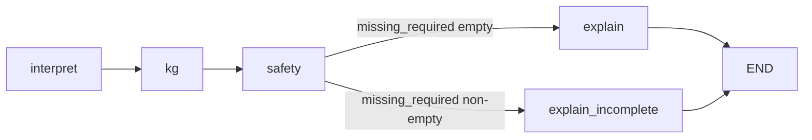

# CareTrace architecture and control flow

This document describes how the **`caretrace`** package is structured, starting from the CLI entrypoint **`caretrace/main.py`**, and how data moves through one **turn** of the conversation.

---

## 1. Repository layout (what each folder is for)

| Path | Role |
| --- | --- |
| `caretrace/main.py` | Interactive CLI: read stdin, call `run_turn`, print reply. |
| `caretrace/config.py` | Loads `.env` (cwd + walk-up from this file), exposes `Settings.from_env()`. |
| `caretrace/state.py` | TypedDicts: `CareTraceState`, `CaseFields`, `TriageDecision`. |
| `caretrace/orchestration/graph.py` | **LangGraph** app: `interpret → kg → safety → explain*`. |
| `caretrace/agents/interpretation.py` | Caregiver text → structured `CaseFields` (LLM or heuristics). |
| `caretrace/agents/explanation.py` | `CaseFields` + `TriageDecision` → assistant reply (LLM or templates). |
| `caretrace/agents/medication.py` | Fever CPG wording, acetaminophen/ibuprofen notes (used by explanation). |
| `caretrace/logic/triage_rules.py` | PyDatalog rules + `evaluate_triage` / `required_missing`. |
| `caretrace/graph/neo4j_client.py` | Neo4j driver factory + `run_cypher`. |
| `caretrace/graph/snomed_retrieval.py` | Text mentions → concept lookup + ancestors (Neo4j). |
| `caretrace/graph/fever_cpg_mentions.py` | Maps `CaseFields` + raw user line → search terms for the KG. |
| `caretrace/evaluation/harness.py` | Replays CSV scenarios through `run_turn` for grading. |

Course notebooks under `KG_implementation/` build the **Neo4j mini-KG**; they are not imported at runtime unless you copy patterns into code.

---

## 2. Entry point: `main.py`

1. **`Settings.from_env()`** (from `caretrace/config.py`) reads environment variables.  
   - `load_dotenv()` runs when `config` is first imported: loads `.env` from the current working directory, then the **first** `.env` found walking upward from `caretrace/config.py` (so a repo-level `D290_NueroSymbolicAI/.env` can work).  
   - Neo4j: `NEO4J_URI`, `NEO4J_USER`, `NEO4J_PASSWORD`, optional `NEO4J_DATABASE`, plus optional `NEO4J_*_KGA` fallbacks.

2. **Initial state** is a `CareTraceState` dict with empty `messages`, `default_case()`, empty `kg_annotations`, `turn 0`.

3. **Loop:** read `Caregiver:` input → append user message to `messages` → set `raw_user_text` → **`state = run_turn(state)`** → print `assistant_reply`.

4. **Optional:** `CARETRACE_EXIT_ON_COMPLETE=1` exits after a turn where `decision.missing_required` is empty (intake complete for triage).

`main.py` does **not** pass `Settings` into `run_turn`; each graph node calls `Settings.from_env()` again so the same env is used consistently.

---

## 3. One turn: `run_turn` and LangGraph

`run_turn` is defined in **`caretrace/orchestration/graph.py`**. It invokes a compiled **LangGraph** `StateGraph` with your current `CareTraceState` and merges the returned updates back into `state`.

### 3.1 Graph topology

### 3.2 Node responsibilities

| Node | Input (from state) | Output (updates state) |
| --- | --- | --- |
| **interpret** | `raw_user_text`, prior `case`, `turn` | **`case`** (merged structured fields), **`turn`** +1 |
| **kg** | `case`, `raw_user_text` | **`kg_annotations`** (SNOMED links + ancestors, or `[]`) |
| **safety** | `case` | **`decision`** (disposition, `missing_required`, rule ids, med flags) |
| **explain** | `case`, `decision` | **`assistant_reply`**, appends assistant `messages` |
| **explain_incomplete** | same as explain (incomplete intake) | same |

**Routing:** `route_after_safety` sends to **`explain_incomplete`** if `decision.missing_required` is non-empty; otherwise **`explain`**.

### 3.3 What `kg_annotations` is for today

The KG step **retrieves** SNOMED-grounded rows for mention terms. The **explanation** agent currently does **not** consume `kg_annotations` in its templates; the field is there for **future RAG**, debugging, or downstream UI. Triage and templates are driven by **`case`** and **`decision`**.

---

## 4. Data shapes

### 4.1 `CareTraceState` (LangGraph state)

- **`messages`**: chat history (`role` / `content`).
- **`raw_user_text`**: latest user line (this turn).
- **`case`**: `CaseFields` — age, temp, vomiting, alertness, breathing, fluids, urine, seizure, meds, etc.
- **`kg_annotations`**: list of dicts from `annotate_case_mentions`.
- **`decision`**: `TriageDisposition` + `missing_required`, `rule_ids`, `med_flags`, …
- **`assistant_reply`**: string shown to the user.
- **`turn`**: counter.

### 4.2 `CaseFields`

Canonical fields after **interpretation** (and optional future normalization). Defaults are mostly `"unknown"` for categorical fields.

### 4.3 `TriageDecision`

Produced by **`evaluate_triage`** in `triage_rules.py`: disposition (`ER_NOW`, `URGENT_SAME_DAY`, `HOME_MANAGEMENT`, `OUT_OF_SCOPE`), plus trace metadata.

---

## 5. Layer details

### 5.1 Interpretation (`agents/interpretation.py`)

- If **`CARETRACE_MOCK_LLM=1`** or **`OPENAI_API_KEY`** unset: **`_heuristic_extract`** uses regex/keywords on free text.
- Else: **LLM** structured extraction into `ExtractedCase`, merged with `prior` case via `_merge_non_empty`.

### 5.2 Knowledge graph (`graph/*`)

- **`kg_mentions_from_case_and_text`**: builds short phrases (e.g. `"fever"`, `"vomiting"`) from **`case`** plus cues from **`raw_user_text`**.
- **`annotate_case_mentions`**: for each term, **`find_concepts_by_term`** then **`ancestors_via_is_a`** against Neo4j (supports `sctid` / `conceptId` + `pt` mini-KG, or `Description` / legacy shapes).
- **`get_driver(settings)`** returns `None` if Neo4j env incomplete or **`CARETRACE_SKIP_NEO4J=1`** → KG node returns empty annotations.

### 5.3 Safety logic (`logic/triage_rules.py`)

- **`required_missing`**: returns human-readable gaps (temperature, alertness, breathing, fluids, urine) until intake is sufficient.
- **`evaluate_triage`**: if anything missing → `OUT_OF_SCOPE` with `incomplete_intake`; else PyDatalog facts + rules → disposition.

### 5.4 Explanation (`agents/explanation.py`)

- Template path: disposition-specific text + medication / CPG snippets from **`medication.py`**.
- Optional LLM path when `OPENAI_API_KEY` is set and mock mode off (see file for full logic).

---

## 6. Other entry points

| Command | Behavior |
| --- | --- |
| `python -m caretrace.main` | Interactive CLI (above). |
| `python -m caretrace.evaluation` / `harness.py` | Loads `scenarios.csv`, replays `turns_json` through `run_turn`, compares `expected_disposition`. |

---

## 7. Configuration reference (env)

| Variable | Purpose |
| --- | --- |
| `OPENAI_API_KEY` / `OPENAI_MODEL` | Optional LLM for interpret + explain. |
| `NEO4J_URI`, `NEO4J_USER`, `NEO4J_PASSWORD`, `NEO4J_DATABASE` | Aura / local Neo4j; `_KGA` fallbacks supported. |
| `CARETRACE_MOCK_LLM` | `1` → heuristics, no OpenAI. |
| `CARETRACE_SKIP_NEO4J` | `1` → no Neo4j driver. |
| `CARETRACE_EXIT_ON_COMPLETE` | `1` → CLI exits after complete intake. |
| `CARETRACE_DEBUG_NEO4J` | `1` → log URI only (never passwords). |

---

## 8. Mental model (one sentence)

**Each user line updates `raw_user_text` → interpretation refines `case` → Neo4j optionally annotates mentions → triage rules fill `decision` → explanation produces `assistant_reply` — all in one `run_turn` call.**
